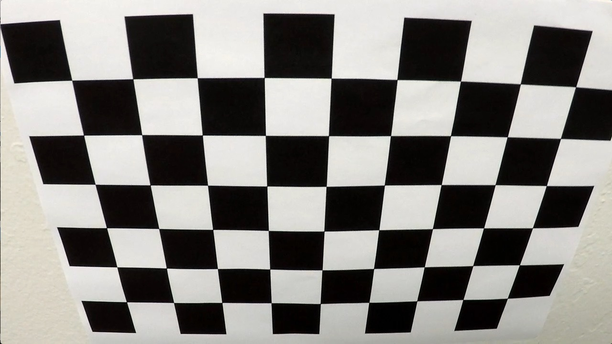
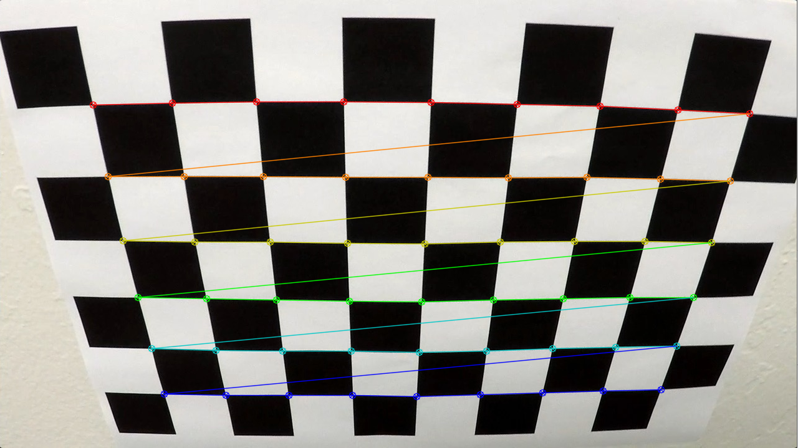
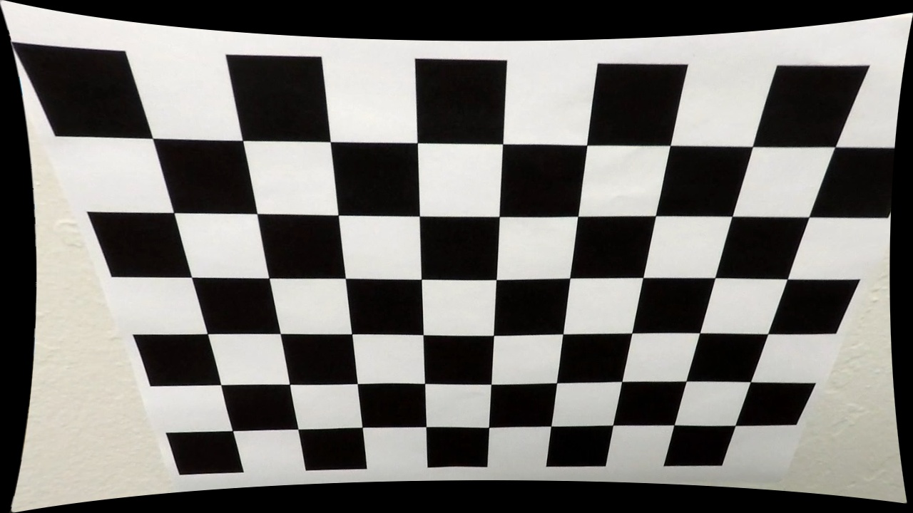
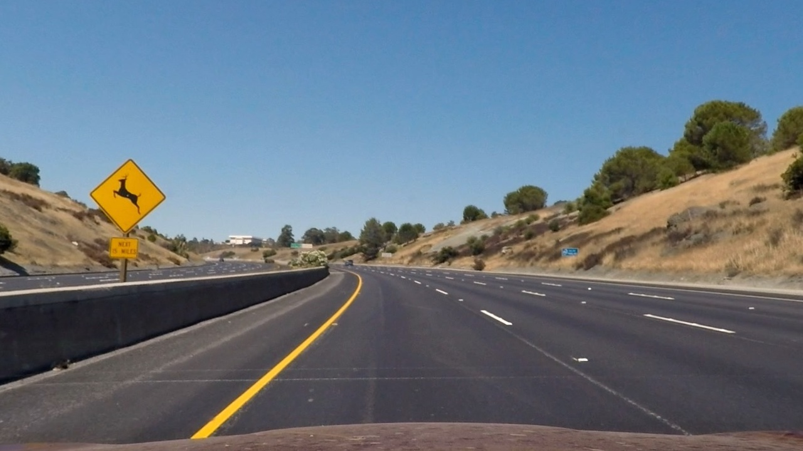
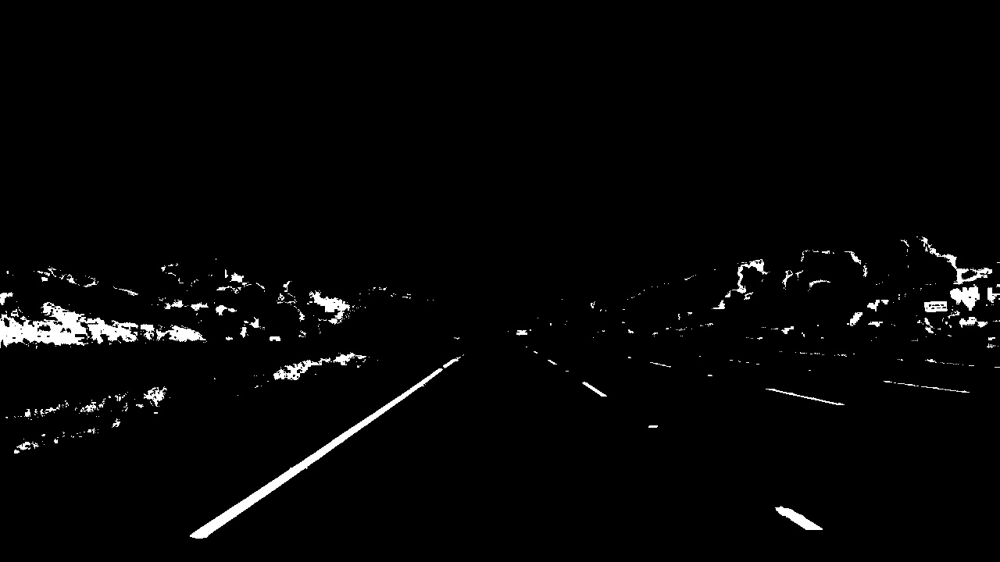
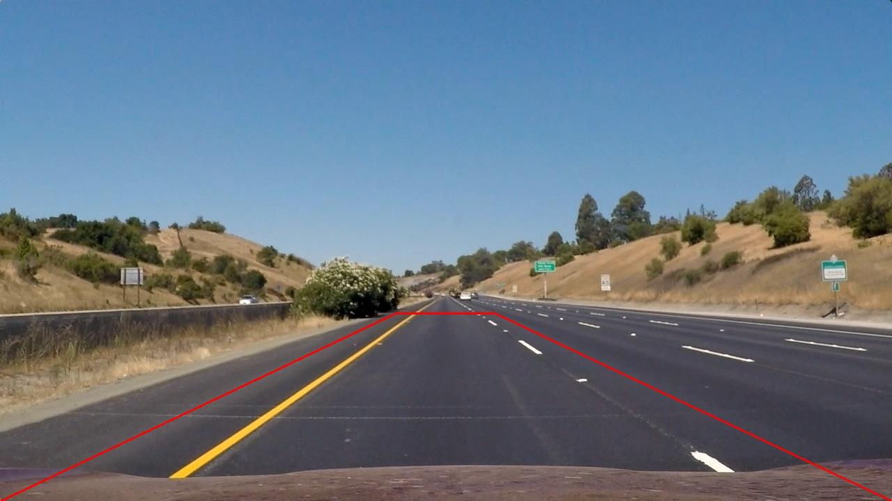
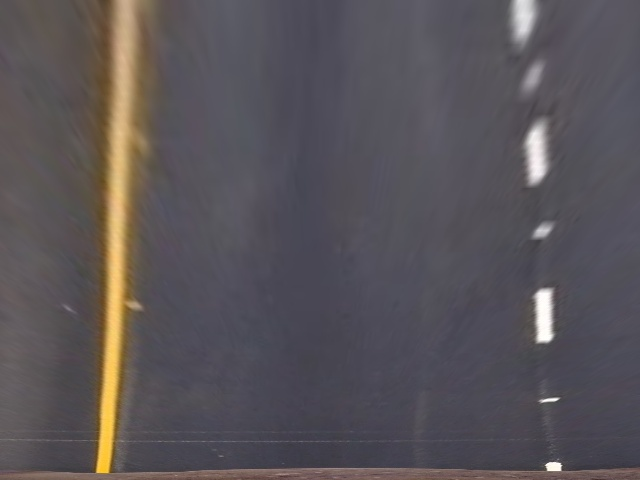
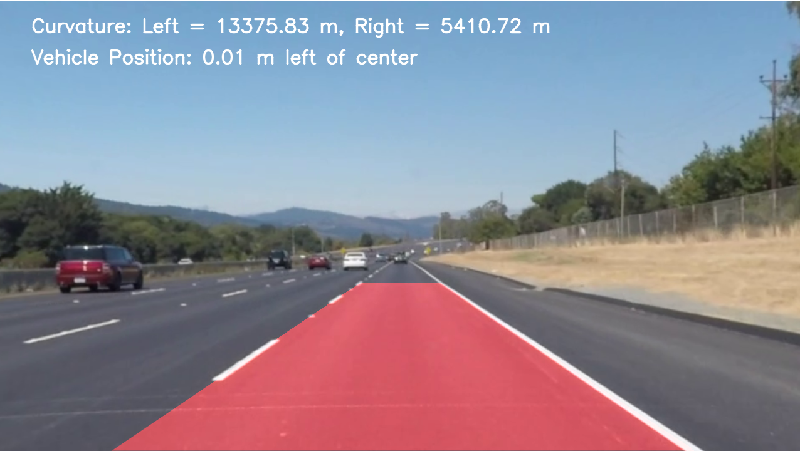
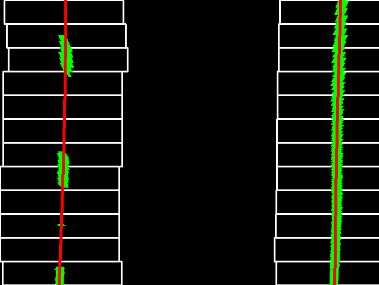

# **Lane Finding Project**

The goals / steps of this project are the following:

* Compute the camera calibration matrix and distortion coefficients given a set of chessboard images.
* Apply a distortion correction to raw images.
* Use color transforms, gradients, etc., to create a thresholded binary image.
* Apply a perspective transform to rectify binary image ("birds-eye view").
* Detect lane pixels and fit to find the lane boundary.
* Determine the curvature of the lane and vehicle position with respect to center.
* Warp the detected lane boundaries back onto the original image.
* Output visual display of the lane boundaries and numerical estimation of lane curvature and vehicle position.

## Camera Calibration

### 1. Briefly state how you computed the camera matrix and distortion coefficients. Provide an example of a distortion-corrected calibration image.

The camera matrix and distortion coefficients were computed using a standard camera calibration procedure with a chessboard pattern. The steps involved are as follows:

1. **Chessboard Calibration**: A set of images containing a visible chessboard pattern was used for camera calibration. The internal corners of the chessboard were detected in each image.

2. **Object and Image Points**: The known 3D object points of the chessboard (fixed positions in real space) were paired with the 2D image points (detected corners in the images) for each calibration image.

3. **Camera Calibration**: Using the object and image points, the OpenCV function `cv.calibrateCamera()` was utilized to compute the camera matrix and distortion coefficients. These parameters are essential for correcting lens distortion and for transforming images captured by the camera into a real-world coordinate system.

4. **Saved Parameters**: If the calibration was successful, the camera matrix and distortion coefficients were saved to a file (`camera_calibration.npz`) for future use. This allows the calibration data to be reused without the need for recalibration in subsequent image processing tasks.

These parameters are later used to undistort images captured by the camera during the lane detection process.

<p align="center">
  
  
  
</p>

## Pipeline

### 1. Provide an example of a distortion-corrected image.

An undistorted image is obtained by applying the `cv.undistort` function, which removes the radial and tangential distortions using the calibration parameters.

<p align="center">
  
  
</p>
<p align="center">Visualy hard to notice.</p>

### 2. Describe how (and identify where in your code) you used color transforms, gradients or other methods to create a thresholded binary image. Provide an example of a binary image result.

To create a thresholded binary image suitable for lane detection, the following techniques were applied:

1. **Color Transformations**: The original image was first converted from BGR to HSV (Hue, Saturation, Value) color space using OpenCV's `cv.cvtColor()` function. The HSV color space allows for easier identification of specific colors, particularly useful for detecting lane markings like white and yellow.

2. **Thresholding for Lane Colors**: 
    - **White Lane Markings**: A range of white colors was defined in the HSV space. Specifically, white pixels were identified by selecting pixels with low saturation and high value (brightness), corresponding to the range `hue: [0, 180]`, `saturation: [0, 30]`, and `value: [200, 255]`.
    - **Yellow Lane Markings**: A range for yellow colors was also defined, using the HSV range `hue: [18, 30]`, `saturation: [94, 255]`, and `value: [140, 255]`. This helps to capture yellow lane markings commonly found on roads.

3. **Binary Mask Creation**: 
    - For both white and yellow lane markings, binary masks were created using OpenCV's `cv.inRange()` function. This function returns a binary image where pixels falling within the defined color range are set to 255 (white), and all other pixels are set to 0 (black).
    - The white and yellow masks were then combined using `cv.bitwise_or()` to create a final mask that includes both white and yellow lane markings.

4. **Final Binary Image**: The resulting binary image highlights the lane markings (both white and yellow) while suppressing the rest of the image, making it easier for further processing steps like perspective transformation and lane detection.

```python
def threshold_image(frame):
    hsv_transformed_frame = cv.cvtColor(frame, cv.COLOR_BGR2HSV)

    white_lower = np.array([0, 0, 200])
    white_upper = np.array([180, 30, 255])

    yellow_lower = np.array([18, 94, 140])
    yellow_upper = np.array([30, 255, 255])

    white_mask = cv.inRange(hsv_transformed_frame, white_lower, white_upper)
    yellow_mask = cv.inRange(hsv_transformed_frame, yellow_lower, yellow_upper)

    return cv.bitwise_or(white_mask, yellow_mask)
```

<p align="center">
  
  
</p>

### 3. Describe how (and identify where in your code) you performed a perspective transform and provide an example of a transformed image.

To create a "bird's-eye view" of the road scene and improve lane detection, a perspective transform was applied to the thresholded binary image. This process involves the following steps:

1. **Selecting Source and Destination Points**:
    - **Source Points**: These points correspond to the region of interest (ROI) in the original image, where the lane lines are expected to be visible. The coordinates were selected manually based on the layout of the road and the expected position of the lane markings. The four points chosen represent the top-left, top-right, bottom-left, and bottom-right corners of the area to be transformed.
    - **Destination Points**: These points correspond to the target perspective (bird's-eye view). The destination points were chosen to form a rectangular area, where the transformed image will have a defined width and height (640x480 pixels).

2. **Applying the Perspective Transform**:
    - Using the source and destination points, the transformation matrix was computed using OpenCV's `cv.getPerspectiveTransform()` function. This function calculates the perspective matrix that maps the source points to the destination points.
    - The image was then warped using `cv.warpPerspective()` and the computed transformation matrix. This applied the perspective change, resulting in a top-down view of the road scene, with lane markings appearing parallel to each other, making lane detection easier.

3. **Inverse Perspective Transform**:
    - Additionally, the inverse perspective matrix (`Minv`) was calculated using `cv.getPerspectiveTransform()` with the reversed source and destination points. This inverse matrix allows for transforming the detected lanes back to the original perspective for overlaying the results on the original image.

By performing this perspective transformation, the process simplifies the detection of lane lines by straightening them in the warped image, making it easier to track the lanes in subsequent steps of the pipeline.

```python
def perspective_transformation(frame):
    img = np.copy(frame)

    # Choosing points for perspective transformation
    top_left = (frame.shape[1]//18*8,frame.shape[0]//8*5)
    top_right = (frame.shape[1]//18*10,frame.shape[0]//8*5)
    bottom_left = (0,frame.shape[0])
    bottom_right = (frame.shape[1],frame.shape[0])

    ## Aplying perspective transformation
    pts1 = np.float32([top_left, top_right, bottom_left, bottom_right])
    pts2 = np.float32([[0, 0], [640, 0], [0, 480], [640, 480]])
    
    # Matrix to warp the image for birdseye window
    matrix = cv.getPerspectiveTransform(pts1, pts2)
    matrixInv = cv.getPerspectiveTransform(pts2, pts1) 

    return cv.warpPerspective(img, matrix, (640,480)), matrixInv
```

<p align="center">
  
  
</p>

### 4. Describe how (and identify where in your code) you identified lane-line pixels and fit their positions with a polynomial.

To identify the lane lines in the binary image and fit their positions with a polynomial, the following steps were performed:

1. **Sliding Window Approach**:
    - The bottom half of the binary image was analyzed to locate the lane line pixels by summing the pixel intensities along each column (x-axis). This summing process produces a histogram, where the peaks correspond to the positions of the left and right lane lines.
    - The peaks of the histogram were used as the initial "base" positions for the left and right lane lines.
    - To refine the positions of the lane lines, a sliding window approach was used. The image was divided into 12 horizontal windows, and for each window, the algorithm searched for nonzero pixels (indicating lane markings) in the vicinity of the initial left and right base positions.
    - The window boundaries were defined, and the algorithm identified the nonzero pixels within each window. These pixels were collected and used to update the positions of the left and right lane lines.

2. **Lane Line Pixel Detection**:
    - For each sliding window, the nonzero pixels in the region of interest (ROI) were identified. These pixels correspond to the actual lane markings in the image.
    - The identified pixels were used to update the current position of each lane line (left and right). If enough valid pixels were found in a window, the algorithm moved the window center to the mean position of the detected pixels in the window.

3. **Polynomial Fit**:
    - Once the lane-line pixels were detected across all windows, a second-order polynomial was fit to the detected pixel positions for both the left and right lane lines.
    - This polynomial fitting was performed using NumPy's `polyfit()` function, which minimizes the least squares error between the pixel positions and the polynomial curve.
    - The resulting polynomial equations for both lane lines provided the x-positions of the lanes as a function of y, allowing for precise lane positioning across the entire image.

4. **Plotting and Visualization**:
    - To visualize the lane lines, the fitted polynomial equations were used to generate x-coordinates for each y-coordinate in the image (from the top to the bottom).
    - These points were then plotted on the output image to create a clear representation of the lane lines.

By using this approach, the lane lines were detected and accurately fitted with polynomials, allowing for the detection of lane curvature and vehicle position relative to the lane.

```python
def sliding_windows(frame):
    # Take a histogram of the bottom half of the image
    histogram = np.sum(frame[frame.shape[0]//2:, :], axis=0) 

    # Create an output image to draw on and visualize the result
    out_img = np.dstack((frame, frame, frame)) * 255

    # Find the peaks of the histogram to locate the starting points for the left and right lines
    midpoint = np.int_(histogram.shape[0] // 2)
    left_base = np.argmax(histogram[:midpoint])
    right_base = np.argmax(histogram[midpoint:]) + midpoint

    # Set hyperparameters for sliding windows
    nwindows = 12          # Number of sliding windows

    # Set height of windows
    window_height = np.int_(frame.shape[0] // nwindows)

    # Identify the x and y positions of all nonzero pixels in the image
    nonzero = frame.nonzero()
    nonzeroy = np.array(nonzero[0])
    nonzerox = np.array(nonzero[1])

    # Current positions to be updated for each window
    left_current = left_base
    right_current = right_base

    # Create empty lists to receive left and right lane pixel indices
    left_lane_inds = []
    right_lane_inds = []

    # Step through the windows one by one
    for window in range(nwindows):
        # Identify window boundaries in x and y
        win_y_low = frame.shape[0] - (window + 1) * window_height
        win_y_high = frame.shape[0] - window * window_height
        win_xleft_low = left_current - 100
        win_xleft_high = left_current + 100
        win_xright_low = right_current - 100
        win_xright_high = right_current + 100

        # Draw the windows on the visualization image
        cv.rectangle(out_img, (win_xleft_low, win_y_low),
                     (win_xleft_high, win_y_high), (255, 255, 255), 2)
        cv.rectangle(out_img, (win_xright_low, win_y_low),
                     (win_xright_high, win_y_high), (255, 255, 255), 2)
        
        # Identify the nonzero pixels in x and y within the window
        good_left_inds = ((nonzeroy >= win_y_low) & (nonzeroy < win_y_high) &
                          (nonzerox >= win_xleft_low) & (nonzerox < win_xleft_high)).nonzero()[0]
        good_right_inds = ((nonzeroy >= win_y_low) & (nonzeroy < win_y_high) &
                           (nonzerox >= win_xright_low) & (nonzerox < win_xright_high)).nonzero()[0]

        # Append these indices to the lists
        left_lane_inds.append(good_left_inds)
        right_lane_inds.append(good_right_inds)

        # If you found > minpix pixels, recenter next window on their mean position
        if len(good_left_inds) > 50:
            left_current = np.int_(np.mean(nonzerox[good_left_inds]))
        if len(good_right_inds) > 50:
            right_current = np.int_(np.mean(nonzerox[good_right_inds]))

    # Concatenate the arrays of indices
    left_lane_inds = np.concatenate(left_lane_inds)
    right_lane_inds = np.concatenate(right_lane_inds)

    # Extract left and right line pixel positions
    leftx = nonzerox[left_lane_inds]
    lefty = nonzeroy[left_lane_inds]
    rightx = nonzerox[right_lane_inds]
    righty = nonzeroy[right_lane_inds]

    # Fit a second order polynomial to each
    left_fit = np.polyfit(lefty, leftx, 2)
    right_fit = np.polyfit(righty, rightx, 2)

    # Generate x and y values for plotting
    ploty = np.linspace(0, frame.shape[0] - 1, frame.shape[0])
    left_fitx = left_fit[0] * ploty**2 + left_fit[1] * ploty + left_fit[2]
    right_fitx = right_fit[0] * ploty**2 + right_fit[1] * ploty + right_fit[2]

    # Draw the lane onto the warped blank image
    out_img[nonzeroy[left_lane_inds], nonzerox[left_lane_inds]] = [0, 255, 0]
    out_img[nonzeroy[right_lane_inds], nonzerox[right_lane_inds]] = [0, 255, 0]

    for i, y in enumerate(ploty.astype(int)):
        if y < frame.shape[0]:
            cv.circle(out_img, (int(left_fitx[i]), int(y)), 2, (0, 0, 255), -1)
            cv.circle(out_img, (int(right_fitx[i]), int(y)), 2, (0, 0, 255), -1)

    return out_img, left_fit, right_fit
```

<p align="center">
  
  
</p>

### 5. Describe how (and identify where in your code) you calculated the radius of curvature of the lane and the position of the vehicle with respect to center.

The `measure_curvature_and_position` function computes the radius of curvature for the left and right lanes based on their polynomial equations. It also calculates the lateral offset of the vehicle from the lane center in meters.

To calculate the radius of curvature of the detected lane lines and the position of the vehicle relative to the center of the lane, the following steps were implemented:

#### 1. **Radius of Curvature**:
   - The radius of curvature for each lane (left and right) was calculated using the polynomial coefficients that were previously determined by fitting the lane lines.
   - To convert the pixel coordinates into real-world measurements, the following conversions were applied:
     - `ym_per_pix`: Conversion factor from pixels to meters in the vertical (y) direction, calculated as the real-world height of the lane divided by the image height.
     - `xm_per_pix`: Conversion factor from pixels to meters in the horizontal (x) direction, calculated as the real-world width of the lane divided by the image width.
     
   - The curvature of a lane is given by the formula:

     $$
     R = \frac{(1 + (2 A y_{\text{eval}} + B)^2)^{1.5}}{|2 A|}
     $$

     where:
     - `A` and `B` are the coefficients from the second-order polynomial fit to the lane line.
     - `y_eval` is the vertical position at the bottom of the image (used to evaluate the curvature at the point where the lane lines are closest to the vehicle).
     - The curvature values were calculated separately for the left and right lane lines using their respective polynomial coefficients.

   - The curvature results give the radius of curvature (in meters) for each lane, which describes how sharp the curve of the lane is. A higher radius of curvature indicates a gentler curve, while a smaller radius indicates a sharper curve.

#### 2. **Vehicle Position Relative to Lane Center**:
   - To calculate the position of the vehicle relative to the center of the lane, the following steps were taken:
     - The center of the lane at the bottom of the image was calculated as the midpoint between the x-positions of the left and right lane lines.
     - The center of the vehicle was assumed to be at the horizontal center of the image (i.e., the midpoint of the image width).
     - The vehicle's position relative to the lane center was then determined by calculating the difference between the vehicle's center and the lane center. This difference was converted into meters using the `xm_per_pix` conversion factor.

     The formula for vehicle position is:  Vehicle Position = (x_car_center - x_lane_center) * xm_per_pix

     where:
     - `x_car_center` is the horizontal center of the image (vehicle's center).
     - `x_lane_center` is the center of the lane at the bottom of the image.
     - The result is a value in meters indicating how far the vehicle is from the center of the lane. A negative value means the vehicle is to the left of the center, and a positive value means the vehicle is to the right of the center.

```python
def measure_curvature_and_position(binary_warped, left_fit, right_fit):
    # Define conversions in x and y from pixels to meters
    ym_per_pix = 30 / 720  # meters per pixel in y dimension
    xm_per_pix = 3.7 / 700  # meters per pixel in x dimension

    # Generate y values for plotting
    ploty = np.linspace(0, binary_warped.shape[0] - 1, binary_warped.shape[0])
    y_eval = np.max(ploty)  # Evaluate curvature at the bottom of the image

    # Refit the polynomials to world space
    left_fit_cr = np.polyfit(ploty * ym_per_pix, left_fit[0] * ploty**2 * xm_per_pix + left_fit[1] * ploty * xm_per_pix + left_fit[2] * xm_per_pix, 2)
    right_fit_cr = np.polyfit(ploty * ym_per_pix, right_fit[0] * ploty**2 * xm_per_pix + right_fit[1] * ploty * xm_per_pix + right_fit[2] * xm_per_pix, 2)

    # Calculate radii of curvature
    left_curverad = ((1 + (2 * left_fit_cr[0] * y_eval * ym_per_pix + left_fit_cr[1])**2)**1.5) / np.abs(2 * left_fit_cr[0])
    right_curverad = ((1 + (2 * right_fit_cr[0] * y_eval * ym_per_pix + right_fit_cr[1])**2)**1.5) / np.abs(2 * right_fit_cr[0])

    # Calculate the vehicle's position with respect to the center
    car_center = binary_warped.shape[1] / 2  # Image center
    left_lane_bottom = left_fit[0] * (binary_warped.shape[0] - 1)**2 + left_fit[1] * (binary_warped.shape[0] - 1) + left_fit[2]
    right_lane_bottom = right_fit[0] * (binary_warped.shape[0] - 1)**2 + right_fit[1] * (binary_warped.shape[0] - 1) + right_fit[2]
    lane_center = (left_lane_bottom + right_lane_bottom) / 2

    vehicle_position = (car_center - lane_center) * xm_per_pix

    return left_curverad, right_curverad, vehicle_position
```

## Video

https://github.com/user-attachments/assets/3585bfd5-5ebb-424a-9233-065afd0974c7

## Discussion

### Problems/Issues Faced

1. **Camera Calibration Data:**
   * If the calibration images are of low quality or poorly lit, the camera calibration might fail, leading to incorrect distortion corrections.

2. **Thresholding Challenges:**
   * The color thresholds for yellow and white lane detection might not work well under varying lighting conditions, such as shadows, nighttime, or overexposed regions.

3. **Perspective Transformation:**
   * The points for the transformation may not always align well with the actual road lanes, especially on curved or uneven roads, causing inaccuracies.

4. **Lane Detection:**
   * Sliding window technique relies heavily on clear lane markings. In scenarios where lane markings are faded, broken, or occluded (e.g., by vehicles or debris), the pipeline may fail to detect lanes accurately.

5. **Curvature and Position Estimation:**
   * Noise in the binary image or incorrect lane detection can lead to highly unstable or incorrect curvature and vehicle position measurements.

6. **Real-Time Performance:**
   * The pipeline might lag on systems without sufficient computational power, particularly when processing high-resolution video frames.

### Potential Failures

1. **Adverse Weather Conditions:**
   * Rain, snow, or fog could obscure lane markings, leading to failure in detection.
   
2. **Complex Road Scenarios:**
   * Intersections, merges, or roads without clear lane markings are likely to confuse the pipeline.
   
3. **Shadow and Lighting Variations:**
   * Shadows from trees, buildings, or vehicles can create false positives or cause lanes to be missed.
   
4. **Non-Standard Lane Markings:**
   * Different road standards (e.g., colors, patterns, or widths of lanes) might render the current thresholds and algorithms ineffective.


### Making the Pipeline More Robust

1. **Advanced Lane Detection:**
   * Use machine learning models trained on diverse datasets to detect lanes more reliably, even under challenging conditions.

2. **Dynamic Thresholding:**
   * Replace static color thresholds with adaptive thresholding techniques to account for lighting variations.

3. **Improved Perspective Transformation:**
   * Dynamically adjust the transformation points based on detected lane positions to better align with road curvature.

4. **Incorporate Contextual Information:**
   * Use historical frame data to smooth out sudden changes in detected lane positions or curvature.

5. **Robust Preprocessing:**
   * Apply histogram equalization or other preprocessing techniques to enhance lane visibility under poor lighting.

6. **Optimize for Real-Time Performance:**
   * Implement hardware acceleration (e.g., using GPU or TPU) or optimize the code for faster execution.

7. **Add Fail-Safe Mechanisms:**
   * Include mechanisms to detect failure cases (e.g., missing lanes) and revert to a backup strategy or alert the driver.
